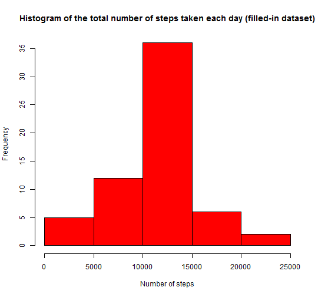

# Reproducible Research

## Assignment 1
  
  
## Introduction
  

In this work, we analyze a dataset downloaded from the course web site: [Activity monitoring data][1]. 
This data consists of the number of steps taken in 5 minute intervals each day, during two months, obtained from a personal activity monitoring device. This device collected data from an anonymous individual at 5 minute intervals through out the day, during the months of October and November, 2012. Once the data has been loaded, we used the R software to answer some questions about the dataset.  
Considering the reproducibility, this document was produced joining explanation text and R code to manipulate data and generate information and figures. In this way, a reader using the same dataset can run the R code below, obtaining the same results.

[1]: https://d396qusza40orc.cloudfront.net/repdata%2Fdata%2Factivity.zip "Activity monitoring data"
  
## Data
  

We have a table with 3 columns and 17,568 rows/observations, obtained from a csv file. The columns/variables are:

. **steps**  : Number of steps taking in a 5-minute interval (missing values are coded NA);

. **date**  : The date on which the measurement was taken in YYYY-MM-DD format;

. **interval**  : Identifier for the 5-minute interval in which measurement was taken.


  
## Loading and preprocessing data
  

Initially, we load the data and then transform the data into a format suitable for our analysis.


```r
#
# read data file "activity.csv" in the work directory
#
steps<-read.csv("activity.csv")
#
# transform "date" column format from factor to Date
#
steps$date<-as.Date(steps$date,"%Y-%m-%d")
```

  
## What is the mean and median of the total number of steps taken per day?
  

In this part, we ignore the missing values in the dataset.
Then, we calculate the total number of steps taken per day, aggregating the table by date. After that, we make a histogram of the total number of steps taken each day.


```r
#
# exclude NA values from table steps
#
stepsna<- na.omit(steps)
#
# aggregate the table stepsna by date, calculating the sum of aggregated values in steps column 
#
stepsday<-aggregate(stepsna$steps, list(date=stepsna$date),sum)
#
# rename columns
#
names(stepsday)<-c("day", "total_steps")
#
# make a histogram of the total number of steps taken each day
#
hist(stepsday$total_steps, main="Histogram of the total number of steps taken each day", xlab="Number of steps", col="red")
```

 


Finally, we find the mean and median of the total number of steps taken per day:

```r
#
# calculate mean and median of the total number of steps taken per day
#
mean_steps<-mean(stepsday$total_steps)
mean_steps<-format(round(mean_steps, 2), nsmall = 2)
median_steps<-median(stepsday$total_steps)
median_steps<-format(round(median_steps, 2), nsmall = 2)
```

Mean = 10766.19

Median = 10765.00

  
## What is the average daily activity pattern?
  

To answer this question, it is necessary to aggregate the table by 5-minute interval,
calculating the mean of aggregated values in the steps column.
In the figure bellow, we have a time series plot of the 5-minute interval (x-axis) and the average number of steps taken, averaged across all days (y-axis).

```r
#
# aggregate the table stepsna by interval, calculating the mean of aggregated values in steps column 
#
avg_steps<-aggregate(stepsna$steps, list(interval=stepsna$interval), mean)
#
# rename columns
#
names(avg_steps)<-c("interval", "avg_steps")
#
# plot the time series of the average number of steps taken 
#
main = "Time series of the average number of steps taken"
plot(avg_steps$interval,avg_steps$avg_steps,type="l",main = main, xlab="Interval",ylab="Number of steps")
```

 

Using the R function which.max(), it is possible to find the 5-minute interval, on average across all the days in the dataset, that contains the maximum number of steps.


```r
#
# find the the 5-minute interval that maximizes the average number of steps taken
#
maxsteps<-avg_steps$interval[which.max(avg_steps$avg_steps)]
print(maxsteps)
```

```
## [1] 835
```
In this case, the 835 interval has the maximum number of steps.

  
## Imputing missing values
  

To fill the missing data, we need to find the rows where steps column is NA.

```r
#
# find the rows in  steps table where the value of steps column is NA 
#
posna<-is.na(steps$steps)
#
# calculate the total number of missing values 
#
nposna<-sum(posna)
```
The number of missing values in the dataset is 2304.


Now, we extract from the original table the rows where steps information is NA, obtaining an auxiliary table. The next step is to merge this auxiliary table with the avg_steps table (obtained above) by "interval" column. In this way, we are going to fill the missing data with the mean for that 5-minute interval.   

```r
# 
# create auxiliary table with rows of original table where steps is NA
#
aux<-steps[posna,]
aux<-cbind(row = as.integer(row.names(aux)),aux)
#
# merge the auxiliary table with avg_steps table (calculated above) where "interval" is the common column.
# it is necessary to order the final auxiliary table to put back the rows in the original positions
#
aux2<-merge(aux, avg_steps, by="interval")
aux3<-aux2[order(aux2$row),]
#
# insert new values in the original table, filling the missing values (NA)
#
steps[posna,1]<-aux3$avg_steps
```


We use the same procedures above to make a histogram and calculate the mean and median of the filled dataset.

```r
#
# aggregate the table steps by date, calculating the sum of aggregated values in steps column 
#
stepsday1<-aggregate(steps$steps, list(date=steps$date),sum)
#
# rename columns
#
names(stepsday1)<-c("day", "total_steps")
#
# make a histogram of the total number of steps taken each day
#
hist(stepsday1$total_steps, main="Histogram of the total number of steps taken each day (filled-in dataset)", xlab="Number of steps", col="red")
```

 

The values below show that mean remains the same and the median value becomes closer to the mean value.  

```r
#
mean_steps<-mean(stepsday1$total_steps)
mean_steps<-format(round(mean_steps, 2), nsmall = 2)
median_steps<-median(stepsday1$total_steps)
median_steps<-format(round(median_steps, 2), nsmall = 2)
print(mean_steps)
```

```
## [1] "10766.19"
```

```r
print(median_steps)
```

```
## [1] "10766.19"
```

Mean = 10766.19

Median = 10766.19

  
## Are there differences in activity patterns between weekdays and weekends?
  

To answer this question, we create a new column indicating whether a given date is weekday or weekend.

```r
#
# create new factor variable indicating whether a given date is weekday or weekend
#
steps<-cbind(steps, weekdays = weekdays(steps$date))
```


We separate the data in two subsets, depending on date is weekday or weekend. Then, we plot the time series of the average number of steps taken in each subset. We made a panel with two graphics, using the base plotting system.

```r
par(mfcol=c(2,1))
#
# filtrate weekdays
# In portuguese, sábado = saturday and domingo = sunday
steps_weekdays<-steps[(steps$weekday!="sábado")&(steps$weekday!="domingo"),]
#
# aggregate the table steps_weekdays by interval, calculating the mean of aggregated values in steps column 
#
avg_steps_weekdays<-aggregate(steps_weekdays$steps, list(interval=steps_weekdays$interval), mean)
#
# rename columns
#
names(avg_steps_weekdays)<-c("interval", "avg_steps")
#
# plot the time series of the average number of steps taken 
#
main <-"Activity Pattern in Weekdays"
plot(avg_steps_weekdays$interval,avg_steps_weekdays$avg_steps,type="l",main = main, xlab="Interval",ylab="Number of steps", ylim = c(-5,225))
#
# filtrate weekends
#
steps_weekends<-steps[((steps$weekday=="sábado")|(steps$weekday=="domingo")),]
#
# aggregate the table steps_weekends by interval, calculating the mean of aggregated values in steps column 
#
avg_steps_weekends<-aggregate(steps_weekends$steps, list(interval=steps_weekends$interval), mean)
#
# rename columns
#
names(avg_steps_weekends)<-c("interval", "avg_steps")
#
# plot the time series of the average number of steps taken 
#
main <-"Activity Pattern in Weekends"
plot(avg_steps_weekends$interval,avg_steps_weekends$avg_steps,type="l",main = main, xlab="Interval",ylab="Number of steps", ylim = c(-5,225))
```

 


From above figures, we can see the difference between weekdays and weekends activity patterns.

  
## Conclusion
  

In this project we learned how to use **knitr** to create a html document that joins text explanation and code to manipulate data and generate plots. Thus, a reader can reproduce our results, applying the described code in the same dataset.
